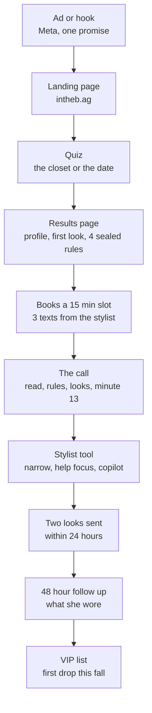
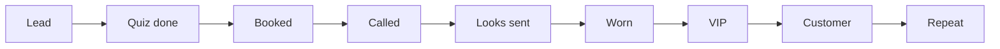

# NOCI Sales Funnel

2026-09-16 · Hanna

How a woman goes from an ad to a free stylist call to her first NOCI order, and what each of us does along the way. Nothing is sold during the test phase; the funnel earns the right to sell.

## The problems we are solving

Online shopping for women's clothes is broken in nine specific ways, and every stage of this funnel exists to fix one of them. Internally we call the big three Scroll Fatigue, Wardrobe Rage and Styling Privilege; those names never appear in customer copy.

| The problem | What it looks like | How we fix it | The number that proves it |
| --- | --- | --- | --- |
| Too many options, no decision | Daydream indexes 10,000 brands. Gap sent 35 emails in 45 days. She scrolls for an hour and buys nothing, or buys the wrong thing | Two looks, not twenty. The stylist chooses; she only has to pick | Looks worn as a share of looks sent |
| Nobody to ask | DTC sites have no human. Wishi charges $60 to $550 before a board. Nordstrom needs an account and a store. Stitch Fix answers in a couple of days | A real stylist on the phone in fifteen minutes, free, and it stays free | Booked calls as a share of quiz completes; show rate |
| Fit and size are a guess | Every brand sizes differently. Online apparel returns run a quarter to a third of orders, and the brand pays shipping both ways. She orders two sizes and returns one | Fit spoken in garment language on the call, brand sizing notes on every piece, and, when the label is live, cut to order in her size | Returns as a share of orders once selling; fit notes completed per call now |
| A full closet and nothing to wear | She owns the pieces and cannot see the outfits. Each new purchase is bought alone and works with nothing | Her closet is the first source. Every new buy must work in three outfits. We send outfits, never items | Share of look pieces that came from her closet |
| Discounts instead of advice | Gap, Skims and Reformation sell on percent off and countdowns. Urgency replaces judgment and she buys what is cheap, not what is right | No codes, no countdowns, no sale language in the test phase. The advice is the product | Minute-13 intent answered yes without any offer on the table |
| Styling is a privilege | Celebrities have Law Roach. Everyone else has a search bar. The knowledge exists; access does not | The playbook puts the best stylists' methods in the brain and a free call puts a human on it | Calls per week; cost per call |
| Every site starts from zero | She re-enters her size, her taste and her occasion on every site, and none of them remember her | Her file: the read, her shape in garment terms, what she wore, what she skipped, every correction. The same stylist every time | Second calls as a share of first calls |
| Trends she cannot use | Editorials say suede and chartreuse. Nothing says what that means for a warm palette, an hourglass shape and a $300 budget | The trend layer is translated through her palette and shape before it reaches her, two signals per look, and refreshed weekly | Trend pieces worn, from the follow-up |
| Occasion panic | A wedding this week and a cart full of maybes | The date quiz, a call the same day, two looks within 24 hours, and pieces that can actually arrive in time | Time from quiz to looks sent |

**What the brand gets in return.** Every fix above produces a data point we can build on: her palette, her shape in garment terms, her spend, the pieces she said yes to, the trends that got worn. That is the demand forecast for the first drop and the training set for the stylist brain. The competitor set (section on why NOCI wins) shows nobody else collects it with a human and a label on the same side of the table.

## The funnel in one picture

Ten steps, one person at a time. The quiz gets her in, the call earns trust, the two looks prove we can dress her, and the VIP list holds her until there is something to buy.

Everything before the VIP list is free and stays free. The first ask for money is the first drop, and by then we know her palette, her shape in garment terms, her spend, and which pieces she said yes to.

## Stage by stage

| Stage | What happens | Who | What we capture | What she gets | Where |
| --- | --- | --- | --- | --- | --- |
| 1. Ad or hook | One promise per creative (the closet, the date, the dress code, the size chart), each with a control | Media buyer | Source, campaign, hook, creative, landing page, all on her lead | A reason to answer six questions | Meta, tagged URLs from the admin Results page |
| 2. Landing page | "The clothes come with a stylist." Fifteen minutes, free, no card, no box | Site | Landing views, quiz starts | The offer in one line | intheb.ag |
| 3. Quiz | The closet: wish, style, palette, prints, silhouette, where it needs help, what's missing, shape, her words. The date: occasion, timing, palette, fear, look, feeling, what matters, her words | She, 2 to 3 minutes | Every answer, plus consent for texts and the marketing list | Nothing yet; the page loads | intheb.ag/the-closet, intheb.ag/the-date |
| 4. Results page | A profile name (The Easy Camel, The Sharp Guest), one outfit built, three held outfit titles, four sealed rule titles | Site | Sealed results seen, ask seen | Her read, and a reason to book | Same page |
| 5. Booking | She picks a 15-minute slot. The stylist sends three texts from her own phone: an hour after, the day before, fifteen minutes before. Outcome, never method | Stylist | Phone, email, booking, show rate | A person, and a time | Admin: Today, Leads |
| 6. The call | Minutes 0 to 3 her read and the rules aloud. 3 to 10 look one, from her closet. 10 to 13 look two. Minute 13 the one-label question. Two prep scores before dialing, a write-up after | Stylist | Sheet accuracy, minute-13 intent, the piece she named, what was missing, what we had to ask, spend | Four rules she keeps, one pairing walked live | Admin: her call sheet |
| 7. Stylist tool | Her answers go in, the pieces that fit her answers narrow it with her, neckline, length, feet, her hero and the one thing to move, what she needs help with, budget. Then the copilot writes each line to say and sources two looks | Stylist | Her likes, necklines, hero, help focus, budget, the piece | Two looks and a held third, on a board | The after-quiz app |
| 8. The send | Two complete looks with photos, prices, links, and the finish: hair, makeup, shoe, layer, night before | Stylist, within 24 hours | Which pieces and trends went out, price per look | The thing she came for | Text or email, the looks page |
| 9. Follow-up | One question at 48 hours: what did you wear, what did you skip, why. One line on her file | Stylist | The conversion signal before there is anything to convert to | A stylist who remembers | Text |
| 10. VIP list | She is on the list for the fall launch: first drops, early sales, styling stays comped | Hanna | The first buyer list, with palette, size in garment terms, spend and yeses on file | Access | The launch |

## The seven touches

Every woman who finishes a quiz gets a fixed sequence of messages, by text where she said yes to texts and by email otherwise. Seven touches, one job each, no discounts, no countdowns. The competitors below send daily and sell on price; we send less and sell on the person who knows her file.

**What the competitors send.** Read from Hanna's inbox, 4 August to 16 September 2026.

| Brand | Cadence | What the sends are | The move worth copying |
| --- | --- | --- | --- |
| Reformation | Daily, 9 am PT, 28 in 45 days | One idea per send with a two-word capital subject (COLOR ANALYSIS, GREAT JEANS, FALL OUTFITTING); sale waves that escalate over five sends from starts now to final hours | One idea, one subject, every send. They even sent "color analysis" as an editorial, which is our whole call |
| Revolve | Twice a week | "New arrivals from your favorite designers" and "Price drop alert" on pieces she favourited, with "only 2 left" | Personalised to what she already touched, not to the catalogue |
| Gap | Near daily, 35 in 45 days | Discount-led, "picked for you", "your invitation", "expires tonight" | Nothing. This is the scroll she came to us to escape |
| Quince | Near daily | Material-led editorial: "Introducing chocolate brown", "new fall silk", "new fall trench coats" | Talk about fabric and colour the way a stylist does |
| Meshki | Twice a week | Back in stock, new arrivals, extra 20 percent, occasion drops ("Re: Your Promotion" for workwear) | Occasion framing in the subject |
| Princess Polly | Only transactional here | Order confirmed, ready to ship, arrived, return booked, return shipped, refunded | Every step of a return acknowledged within the hour. Ours should be the same for every step of a call |
| Stitch Fix | Daily | A two-minute welcome survey, daily "your sale shop" nudges, a birthday email, "how to find your perfect jeans" tips, $250 app credit | The birthday and the tips. Not the daily nudging |
| Wishi | Five near-identical "your stylist is ready when you are" in eight days | Booking nudge with the same GIF; when Hanna booked, nobody showed and support said the calendar was broken | Send the nudge once, then a different one, and never promise a call the calendar cannot keep |
| Skims | Daily during a loyalty event | Ends tomorrow, ends today, final hours | The countdown shape works for a first drop, once a year, without a discount |
| Cider | Daily | Occasion-led subjects ("DATE NIGHT? SAY LESS.", "THE WORKWEAR LINEUP"), a store opening, an app offer | Lead with the occasion, which our quiz already gives us |

**Our seven.** Timings run from the moment each stage completes. Copy is in the house voice: lowercase, plain, outcome not method, never "free" as the headline.

| # | Trigger | When | Channel | Subject or first line | The job |
| --- | --- | --- | --- | --- | --- |
| 1 | Quiz finished, no slot picked | 1 hour, then 24 hours, then stop | Text if consented, else email | "your read is in. The Easy Camel. pick fifteen minutes and she opens your four rules." Second send: "one of your rules is going to annoy you. it's the five-minute one. still free." | Book the call. Two sends, then silence until touch 6 |
| 2 | Slot booked | Immediately, an hour after, the day before, fifteen minutes before | Text, from the stylist's own phone | "hi Hanna, \[stylist\]. read yours, built you four looks. talk at 10 tomorrow." Then the two existing reminder texts | Show rate. The admin already holds these three; the confirmation is the only addition |
| 3 | Call missed | 30 minutes after, then 3 days later | Text, then email | "missed you. your rules don't expire. here's your move-it link." Then: "still holding your four. one tap to pick a new time." | Rebook. Two sends, then the lead goes to touch 6 |
| 4 | Call done | Within 24 hours | Email with the looks page, text with the link | "Hanna, your two looks. The Column in Toffee is Saturday." | The thing she came for. Photos, prices, links, the finish |
| 5 | Looks sent | 48 hours after the event date, or 5 days after the send | Text | "what did you wear, what did you skip? one line. it goes on your file." | The learn step. Her answer is a line on her file and a row in the tip bank |
| 6 | On the list, no call in the last 30 days | Weekly, Thursday 9 am PT | Email | One idea per send, two-word subject in the Reformation shape, built from the playbook: THE BLOCK HEEL, SUEDE, FIRST DROP; occasion-led when the calendar says so: THE WEDDING, THE WORK THING | Stay the stylist she remembers. One trend from section 7 with the under-$100 buys, one rule from the sealed set explained in three lines, one "book fifteen minutes for what's next" |
| 7 | The first drop | Announce two weeks out, early access one week out, drop day, last day | Email and text | "you're on the list. the first drop is the pieces your stylist kept asking for. your size, made when you order it." | The first ask for money, to people who have already been dressed by us. Skims' countdown shape, no discount |

**How the looks are sent (touch 4).** Checked 16 September 2026 against what the field does. [Wishi](https://www.wishi.me/pricing) delivers two shoppable style boards per session inside its app, each piece linked. [Nordstrom stylists](https://www.facebook.com/anchoragedailynews/posts/stylists-will-guide-shoppers-to-a-personalized-wardrobe-which-customers-can-then/1612829542072992/) make shoppable outfits and text, email or video-call them; a client on [Reddit](https://www.reddit.com/r/fashionwomens35/comments/1eozzoj/my_nordstrom_styling_experience/) asked for texted pictures and got six looks by text. The lookbook trade has moved off PDF attachments to links, because a link opens on a phone, can be updated after sending, and shows whether she opened it ([Fast.io](https://fast.io/resources/fashion-lookbook/), [Shopify](https://www.shopify.com/blog/lookbooks-how-to-use-high-quality-lifestyle-photos-to-boost-sales)).

So the send is three things, in this order:

1. **A text** with one picture of the board and one link to her page. Under 300 characters before the link. The picture is what she screenshots and forwards; the link is what she shops from.
2. **Her page**, a personal mobile page at a link only she has (intheb.ag/looks/her-name once built; until then the saved page hosted by Krish). Two looks, the held third, every piece with a photo, price and link, and the finish for each. It can be updated after it is sent when a piece sells out.
3. **The email**, the same content as the durable copy, sent within the hour of the text. Subject in her name: "Hanna, your two looks for the wedding."

No PDF unless she asks; it does not open well on a phone, cannot be updated, and cannot be tracked. The stylist app now produces all three from the looks screen: copy the text, copy the email, save the board picture, save her page, and print to PDF for the one who asks.

**Rules for all seven.** Never more than two sends in a week outside a booked call. Every send names her profile or her occasion, or it does not go. No send promises a time the calendar cannot keep; if availability is empty, touch 1 pauses. A reply to any text goes to a person within the hour, the way Princess Polly acknowledges every step of a return. Transactional sends (booking, move, cancel) go instantly and are not counted.

**What this needs built.** Touches 2 and the move-it link exist in the admin. Touches 1, 3, 5 need text automation on the lead's consent record; touches 4, 6, 7 need an email sender with the looks page as a template. Klaviyo or Attentive would carry all seven from the admin's lead export; the copy above is the brief.

## What we are testing right now

We are testing whether a free phone call converts, not whether a product sells. Nothing is sold in this phase on purpose: the one-label question at minute 13 is asked as research, and the answer is the demand forecast for the first drop.

- **Two questions, in order.** Does a variant's quiz give the stylist a better call sheet than the control's (the two prep scores before dialing, blind)? And does it turn more landing views into booked calls? The first needs 20 rated calls per cell. The second needs thousands of landing views, so the fortnight read is directional.
- **The variants.** Control is live at the root. The closet, the date, the dress code and the size chart are built and waiting on their ad sets. Wave one runs two variants against control, not four, because one stylist does about 12 calls a day.
- **The decision rule.** Promote a variant only when its prep score beats control by 0.8 points at 20 rated calls per cell, or its booking rate is higher with intervals that do not overlap. Retire a variant on show rate only past 40 booked calls. Otherwise keep collecting; never decide on noise.
- **What makes the read possible.** Every call gets scored before dialing and written up after. A booked call that is not scored is a call that never happened for the test. This is the single biggest thing the team can do this week.
- **What is deliberately absent.** No discount, no code, no countdown, no product pitch on the call, no PDF of the rules. The rules are spoken, the looks are sent, and the relationship is the product until fall.

## The stylist's toolkit

Four things, and each one has one job.

| Tool | What it is | When you use it |
| --- | --- | --- |
| [The Styling Playbook](https://claude.ai/code/artifact/6f5996d9-b899-4704-af53-62c72c7e452d) | The house rules, the call script, the profile grids, the look formulas, this fall's trends with under-$100 buys, the color rule, the icons. It refreshes itself: trends every Monday, the seasonal calendar on the 1st | Read sections 2 to 6 once. Open section 7 before every look |
| Stylist intelligence (second tab of the playbook) | Sixteen reference stylists: what each has said in public, their signature looks, how we apply it, and a tip bank of lines to say keyed to the quiz answers. New interviews are added on the 15th | When she names an icon, or when you need the line for a problem she just described |
| [The after-quiz app](https://claude.ai/artifact/QoU3KrgAKp4RpXJEWcriP8) | Her answers go in. It shows the pieces that fit them so you narrow neckline, length and feet with her, asks what she needs help with, gives you her read and her rules, then writes each line of the call and sources two looks live from the stores, with photos, onto a board | On every call, from the moment you dial. The board is what you send |
| [The admin](https://intheb.ag/admin/today) | Today's calls, every lead, her call sheet with the two prep scores and the write-up form, the A/B results, availability, photos, stylists, settings | Score before you dial, write up within five minutes of hanging up |

**How they fit together.** The admin holds her answers and the test. The playbook holds how we style. The app turns her answers into the call and the looks. The intelligence tab is where the app's voice comes from.

**Her file, and why it is the moat.** From 16 September the app keeps a file per client: her answers, what she tapped, her read and rules, the looks she got, the call transcript, every piece the stylist swapped or dropped and why, and what she wore at 48 hours. A second call opens with that file in the brain, so she is never asked twice. The corrections are the part nobody else has: a stylist's judgment over the machine's, logged every time. That log is the training set for the best AI stylist, and it only exists because a human is on the call. The brain itself now carries the house principles, the fall trends, the colour rule for eight palettes and four colour seasons, a fit and proportion layer by height, shape and where her length sits, and the methods of sixteen of the best stylists working, paraphrased from their own interviews.

## Who does what, and when

| When | Stylist | Hanna | Media buyer |
| --- | --- | --- | --- |
| Every morning | Open Today in the admin. For each call: score the sheet (two numbers), read her words twice, open the app and put her answers in | Check Leads for anyone flagged with her own words and anyone unbooked after seven days | Check spend and landing views per hook |
| Every call | Dial from the sheet. Run the clock: read and rules, look one from her closet, look two, the minute-13 question. Narrow with her in the app |  |  |
| Within 5 minutes after | Write it up: sheet accuracy, her minute-13 answer, the piece she named, what was missing, what you had to ask, one note |  |  |
| Within 24 hours | Send the two looks from the app's board, with the finish |  |  |
| 48 hours later | One text: what did you wear, what did you skip, why. One line on her file |  |  |
| Monday | Read the refreshed trend section before the week's looks | Read the Results page. Count rated calls per cell. Decide nothing under 20 | Rotate creatives that have not hit their view target |
| 1st and 15th |  | Check the seasonal calendar and the new stylist lines landed |  |
| Weekly | Add one line to the tip bank when a client says a problem a new way | Tally minute-13 answers by profile name; add icons named on calls to the library; decide when the closet and date ad sets go live | Report views, starts, completes, bookings per variant |

**Capacity.** One stylist, one calendar, about 12 fifteen-minute calls a day at a 50 to 60 percent show rate. That is the ceiling on everything above it, which is why the app exists: it takes the sourcing and the write-up off the stylist so the 15 minutes stay hers.

## The pipeline

Every lead sits in exactly one stage. A stage has an entry rule, an exit rule, an owner and a clock. When the clock runs out the lead does not sit there; it moves to the fallback and someone is pinged. This is the board the team looks at every morning.

| Stage | Enters when | Exits when | Owner | Clock | If the clock runs out |
| --- | --- | --- | --- | --- | --- |
| Lead | A quiz is started (landing beacon) | She finishes the quiz | Media buyer | 48 hours | Retargeting audience; no message, she gave us nothing yet |
| Quiz done | Answers and consent are on her lead | She picks a slot | Caller | 24 hours | Touch 1 at 1 hour and 24 hours, then Nurture (touch 6) |
| Booked | A slot is on the calendar | The call starts (call started stamp) | Stylist | The slot time | No-show: touch 3 at 30 minutes and 3 days, two rebook chances, then Nurture |
| Called | The call started; the two prep scores exist | Write-up saved and looks sent | Stylist | 24 hours from hang-up | Overdue alert to the stylist at 20 hours and to Hanna at 28 |
| Looks sent | Text and email out, her page live | Follow-up answered | Stylist | 48 hours after the event date, or 5 days | Touch 5 fires; unanswered after 7 days moves to Nurture with a note |
| Worn | She told us what she wore | She opts into the list, or 30 days pass | Stylist | 30 days | Nurture |
| VIP | Opted in, spend and yeses on file | The first drop | Hanna | Until launch | Weekly edit (touch 6) keeps her warm |
| Customer | First order | Second order or a second call | Hanna, then the stylist | 60 days | Touch 6 with her stylist's name on it; a call offer for the next occasion |
| Repeat | Second order or second call | Never; she is ours | Stylist | 90-day check-in | Call offer |
| Nurture (parking, not a stage) | Any clock above ran out | She books a call or replies | Automation | Weekly | Touch 6 only, two sends a week max across everything |

**Three rules that keep the board honest.** A lead moves forward on a fact the system can see (a booking, a call-started stamp, a saved write-up), never on a feeling. A lead moves backward only to Nurture, never to an earlier stage. Nobody owns a lead in two stages; the owner column is who is pinged.

## The lead record and scoring

One record per woman, and everything we ever learn goes on it. Today it is split across the admin (the lead and the call) and the app (her styling file); the CRM job is to join the two on her phone number.

| Group | Fields | Written by | Lives in |
| --- | --- | --- | --- |
| Identity | First name, phone, email, consent per channel with version and date, marketing list yes or no | The quiz | Admin lead |
| Source | Source, campaign, hook, creative, landing page, quiz variant, came-in timestamp | The tagged URL | Admin lead |
| Quiz | Every answer for her variant, her words verbatim, profile name, first look shown, four sealed rule titles | The quiz | Admin lead, copied to her file |
| Booking | Slot, created, state (booked, completed, no-show, moved), move-it link, three texts sent | Scheduler and stylist | Admin lead |
| Call | Two prep scores, call-started stamp, sheet-accuracy score, minute-13 answer, the piece she named, most and least useful question, what was missing, what we had to ask, note | Stylist, in the call sheet | Admin lead |
| Styling | What she tapped (pieces, neckline, length, feet), hero, the one thing to move, help focus, budget, the piece she owns | Stylist, in the app | Her file |
| Looks | Two looks and the held third, every piece with retailer, price, link; the finish; the transcript | The app | Her file |
| Corrections | Every swap and drop the stylist made, with the reason | Stylist, in the app | Her file |
| Outcome | What she wore, what she skipped, why; spend band; retailers she buys and wishes she could; icon named | Stylist, from the follow-up | Her file |
| Stage | Current pipeline stage, entered-at, owner, next action, next action due | The CRM | CRM |

**Scoring.** Three temperatures, computed from facts, recomputed nightly.

| Temperature | Rule | What it changes |
| --- | --- | --- |
| Hot | Minute-13 answer was "yes, all of it" or "one piece", or she wore a look, or spend band is $300 and up | First in the queue for the first drop; the stylist calls her personally about it |
| Warm | Called and looks sent, no follow-up answer yet, or minute-13 was "later" | Touch 5 and touch 6; a call offer for the next occasion at 30 days |
| Cold | Quiz done and never booked, or two no-shows, or minute-13 was "no" | Touch 6 only. Never more than one send a week |

**Segments the team will actually use.** By profile name (sixteen closet, sixteen date), by occasion, by palette, by spend band, by hero. The first drop is merchandised against the yeses by palette and hero; the weekly edit is sent by occasion.

## Automations and alerts

Two kinds. Sends go to her without a person (the seven touches). Alerts go to a person because a clock ran out or a fact needs eyes. The rule for both: a send names her profile or her occasion, and an alert names the one action to take.

**Sends, without a person**

| Trigger | Send | Channel | Stop when |
| --- | --- | --- | --- |
| Quiz done, no slot, 1 hour | Touch 1a: your read is in, pick fifteen minutes | Text if consented, else email | She books |
| Quiz done, no slot, 24 hours | Touch 1b: one of your rules is going to annoy you | Same | She books; then Nurture |
| Slot booked | Booking confirmation, plus the three stylist texts at 1 hour, the day before, 15 minutes before | Text from the stylist's phone | Call starts |
| Booking moved or cancelled | Confirmation of the new time, or the move-it link | Text and team email | Always |
| Call marked no-show, 30 minutes | Touch 3a: missed you, your rules don't expire | Text | She rebooks |
| No-show, 3 days | Touch 3b: still holding your four | Email | She rebooks; then Nurture |
| Looks sent | Touch 4: her page link, board picture, the email | Text and email | Always |
| Event date plus 48 hours, or send plus 5 days | Touch 5: what did you wear | Text | She answers; after 7 days, Nurture |
| In Nurture or VIP, Thursday 9 am PT | Touch 6: the weekly edit | Email | She books or unsubscribes |
| First drop minus 14, minus 7, day of, last day | Touch 7 | Email and text | Drop ends |

**Alerts, to a person**

| Trigger | Who is pinged | The one action |
| --- | --- | --- |
| New lead with words in her own words | Caller, immediately | Read them before anything else; book her first |
| Booked call in 24 hours with no prep scores | Stylist, at 9 am | Score the sheet before dialing |
| Call ended, no write-up in 5 minutes | Stylist | Write it up now, while it is fresh |
| Looks not sent 20 hours after the call | Stylist; Hanna at 28 hours | Send them, or say why not |
| Touch 5 unanswered after 7 days | Stylist | One personal text, then let Nurture have her |
| A reply to any text | Whoever owns the stage | Answer within the hour |
| Availability shows fewer than 10 open slots in the next 7 days | Hanna | Add slots or pause touch 1 |
| A hot lead (minute-13 yes, or wore it) | Hanna | Add her to the first-drop personal-call list |
| Show rate under 50 percent over the last 20 booked | Hanna | Review the three texts and the slot times |
| Rated calls per cell reach 20 | Hanna and Krish | Read the test |
| A stylist swaps or drops a piece the brain chose | Nobody; it logs | Reviewed monthly as the training set |

**Guardrails on all automation.** Two sends a week maximum per person across every flow. No send while a call is booked in the next 24 hours except the reminder texts. A reply pauses every automated send to that person for 48 hours. Consent version is checked on every send. Nothing automated ever names a price, a discount or a deadline in the test phase.

## Dashboards and the stack

**Three views, and who opens them.**

| View | When | What is on it | Source |
| --- | --- | --- | --- |
| Today | Every morning, the stylist and the caller | Calls in order with prep scores done or not; looks overdue; follow-ups due today; replies waiting; open slots this week | Admin Today, plus the CRM's next-action list |
| The week | Monday, Hanna | The funnel by variant: views, starts, completes, booked, show rate, rated, looks sent on time, worn; the biggest drop between two neighbours; rated calls per cell against 20 | Admin Results |
| The month | First of the month, Hanna and Krish | Cohorts by quiz week: quiz to booked to called to worn to VIP; hot warm cold counts; spend bands; the yeses by palette and hero (the first-drop forecast); stylist corrections and feedback by type (what the brain keeps getting wrong); cost per call | CRM export plus her files |

**The stack, and what each piece is the system of record for.**

| Piece | Records | Status |
| --- | --- | --- |
| The site and admin (intheb.ag) | Leads, quiz answers, consent, bookings, the call sheet, the A/B read | Live |
| The stylist app | Her styling file: taps, looks, corrections, stylist feedback, follow-up, second calls | Live, org-internal |
| The playbook and stylist intelligence doc | How we style; refreshes itself weekly and monthly | Live |
| Messaging: Klaviyo or Attentive | The seven touches, consent-aware, with the lead export as the audience | To set up. Klaviyo covers email and text in one place; Attentive is stronger on text if text becomes the main channel |
| CRM: HubSpot free tier, or a Notion or Airtable board until 200 leads | Pipeline stage, owner, next action, temperature, alerts | To set up. The admin is the lead record; the CRM is the board. Salesforce is the wrong size for this year |
| Glue: Zapier or Make | Lead export to messaging and CRM on a schedule; alerts to Slack | To set up |
| Her page hosting: intheb.ag/looks/her-name | The link in the text | To build (Krish) |
| Slack | Alerts, the daily call list, the reply queue | Live |

**One join key.** Her phone number ties the admin lead, her styling file, the messaging profile and the CRM record together. Every export carries it; nothing is created without it.

## How the app finds the pieces, and the rack

**Who it is for comes first.** Before any question, the stylist logs her name, her phone (the join key), her size, her age range and the stores she already shops. The questions and the stores are chosen for her, not for the stylist.

**The questions run like a stylist's.** One per message, each with tappable answers: what is coming up, where and when; the dress code and who is there; a this or that with pictures (the slip, the corset, the halter, pulled live as images, garments only, never a person); her palette by colour name; how clothes sit and where she likes skin; her hero; the brands she buys and one she wishes she could; a style icon, names only; budget; what she already owns; what she needs help with. Up to eight. From the second question on, "run with it" is always an option, and the stylist has a run with it button too. The brain then infers the rest and builds.

**The search is wide and rule driven.** The brain runs at least six searches before it chooses anything: three phrasings for the hero built from the rules (the formula, her neckline, the colour by name, the fabric), then one each for the shoe, the jewelry, the bag or layer. The store search hits up to sixteen stores at once, chosen by her age tier: young (princess polly, meshki, white fox, edikted, beginning boutique, dissh, with jean, bec and bridge, oh polly, frankies, tony bianco, steve madden), mid (sir, posse, damson madder, kitri, faithfull, aya muse, silk laundry, cult gaia, staud, hemant and nandita, missoma, alohas, by far, gorjana, by chari) and classic (anine bing, everlane, doen, christy dawn, hill house, staud, cult gaia, alo). Brands she named that are not on that list go through web search (zara, revolve, lovers and friends) and the page reader. It compares at least six real candidates for the hero.

**The rack comes before the reveal.** Nothing is built until the human stylist has seen the rack: eight to twelve real pieces with store, price, picture, one line of why, and the brain's own picks pre ticked. The stylist unticks what is not her, adds a line if she wants (softer, less skin, the red one is the hero), and only then are the two looks and the held look built from those pieces. Runners up show under each look as alternates, and every look carries the three rules it runs on.

**What she receives looks like a stylist's tear sheet.** Each look is a square collage with its title inside: the store's own product shots layered on white, never cut out by hand, and one editorial photo that has to match her occasion or it is left off. Beside it sits a grid of product cards with the brand, the price and a shop link. No prices on the collage itself; it is her inspiration. The stylist can drag or resize any tile on either board, replace a tile with her own photo, swap a piece with a link, add a line of text, change the paper colour, and edit every word before it goes.

**Saving and sending, whole or in pieces.** Copy the text, copy the email, save the board picture, save her page, print to PDF, or take bits: one look as a single picture, the second board alone, the text for one look only.

**Three ways in.** Put her quiz answers in and narrow it with her, brands first and then real pieces from those brands. Skip ahead and just ask her, where the stylist logs who it is for and the app asks the rest. Or just get a look: her name and one line, no questions, straight to the pieces. Tapping run with it at any point jumps to the rack, which shows what is being searched while the pieces land.

**The occasion rules come before her colour answers.** The app asks which side of the occasion she is on, because it flips the rule: a bride at her bachelorette is in white or ivory only, a wedding guest is never in white. The full table is in the playbook under occasion conventions.

**This week's looks.** Two tabs, rebuilt every Monday from the fashion press (Vogue, WWD, Harper's Bazaar, Elle, Who What Wear, The Cut, Porter and others), each card with its source, a photo from the article itself, why it matters now, and a line to say. From any card the stylist can ask her about it on the call, put it on her board, text her the tip (written for her, logged on her profile), or start a mood board for someone.

**Her files are profiles.** One profile per woman. Sessions under the same name sit together on their own. A profile holds what we know, every look from every session as product cards, mood boards, what the stylist changed, what she wore, the trend tips we sent and notes. Profiles can also be made by hand before a first call.

## The grading loop: how the stylists make the brain better

Every look that leaves the app gets graded by the human stylist, on the looks screen, in under a minute. That grade is the training data. Nothing else in the company compounds like it.

| What the stylist marks | Where it goes | What it changes |
| --- | --- | --- |
| A tag on the output: good send it, board makes no sense, picture missing, price missing, wrong piece for her, story is off, look two moved too much, asked the wrong question, too old, too young, ignored what she tapped | The feedback log, with her occasion and palette attached | The brain reads the last 40 notes at the start of every call and is told to fix those patterns |
| A line in the stylist's own words: the one shoulder was right, the story should be ten percent softer | Same log | Same; the words matter more than the tags |
| Swap a piece with a link, or drop it, with a one-line reason | Her file | Her next call starts from the corrected looks |
| What she wore, skipped, and why, 48 hours after | Her file | The follow-up is the ground truth for the whole system |
| Board moved around, paper colour changed, a tile taken off | Stays on the picture she gets | Nothing yet; watch what stylists remove most and fix the layout |

**Weekly.** Hanna reads the feedback log on Monday with the numbers. Any tag that shows up three times in a week becomes a rule in the playbook and the brain the same day. Any stylist line that names a principle (softer, younger, less skin) goes into the language section of the playbook.

**Hard rules already in the brain from the first round of grading.** Every piece must carry a real price and a picture before it is delivered, or the brain opens the page to get them or picks another piece. No trousers in a dress look unless she asked. Look two changes exactly one thing from look one. The neckline and hero she chose hold in every look. The board carries no prices; it is her inspiration, built from her setting, her season and her palette, not just the clothes.

## What would improve it most, in order

**The app has never seen her.** It styles from words, and every stylist we admire starts from a photo. Three photos on her file would improve the looks more than anything else here: a mirror photo of how she actually dresses, the three closet pieces she wears most, and one saved look she loves. The brain can read images, so the rack and the board get built against them, and the sourcing order (her closet first) finally has something to source from. Today that stage is theatre. Capture them on the call: the stylist asks, she texts them, they go on her file.

| Order | Change | Why | What it takes |
| --- | --- | --- | --- |
| 1 | Her photos on the file, before sourcing | The single biggest lever on look quality; unlocks closet-first sourcing | A photo upload on the call screen, the brain reads images, the rack judged against them |
| 2 | Sourcing off the call | The rack takes three to four minutes of silence live. The protocol already promises looks within 24 hours | End the call, source after, the stylist picks from the rack later that day |
| 3 | Size in stock on every piece | A look in a size that is not in stock is worth nothing; the page reader already returns sizes | The brain confirms her size before the rack, the rack shows it |
| 4 | Three taps on her page | The send is one way today; we learn nothing until the follow-up call. Love it, not me, show me more, straight onto her file | Her page hosted at intheb.ag/looks/her-name with the taps wired to the file |
| 5 | A fixed question script | The brain's questions drift between calls, so calls are not comparable and the A/B cannot read them | The eight questions fixed in order, the brain only adds follow-ups |
| 6 | A nightly product index | Live search is fragile: stores rate-limit bursts and some image hosts block us | Index the tier stores nightly; the rack becomes instant and the affiliate links attach to the same index later |
| 7 | A trending looks feed for the stylist | The playbook's trend layer is words; on a call the stylist needs pictures to react to and ideas to offer when she does not know. Inspiration is how in-store stylists open a conversation | An inspo screen in the app: this week's looks by palette and occasion with images, the trend line under each, and one tap to put a look on her board or into the this or that question. Fed by the Monday trend refresh so it stays current |

If we do one, the photos. If we do two, sourcing off the call.

## What is missing before launch, and the handover

**Not built yet, in the order it matters.**

1. Messaging. Klaviyo or Attentive connected to the lead export, with the seven touches loaded and consent respected. Without it every touch is manual.
2. Her page hosted at intheb.ag/looks/her-name, so the text carries a real link instead of a saved file. Krish.
3. The CRM board with the nine stages, the temperature and the next action per lead. HubSpot free or a Notion board.
4. A product index of the stores we send to, refreshed nightly, so sourcing gets faster and cheaper than live search on every call. Affiliate links on the same index when we are ready to earn on them.
5. A closet capture step: three photos of what she wears most, taken on the call, on her file. The sourcing order starts with her closet and today we only hear about it.
6. An evaluation set: 30 real calls with the stylist's grades, rerun against the brain after every playbook change, so we know a change helped before it reaches a customer.
7. The site quiz still offers four palettes; the app and the brain work with eight. Align the quiz.

**The handover checklist for the team.**

- Read this document once, then the playbook's house rules and language sections. Thirty minutes.
- Get access: the admin, the stylist app, the playbook doc, Slack, the feedback log.
- Shadow two calls, run two calls with a lead stylist listening, then run alone.
- Every call: prep scores before, the call sheet during, the write-up after, the grade on the looks, the send within 24 hours, the follow-up at 48.
- Never: discounts, urgency, a comment on her body, a celebrity image in anything she sees, the words algorithm or AI.
- When something in the output is wrong, grade it in the app rather than fixing it quietly. A quiet fix helps one woman; a grade helps every call after it.
- Ask in Slack when the sheet does not cover it, and say what you did in the meantime.

## The numbers we watch

One number per stage, in order, all on the admin's Results page. The biggest drop between two neighbours is the week's work.

| Stage | Number | Where it comes from |
| --- | --- | --- |
| Ad | Landing views per hook | Tagged URLs, GA4 |
| Landing | Quiz starts | Beacon |
| Quiz | Completes | Beacon |
| Results | Sealed results seen, ask seen, scheduler opened | Beacon |
| Booking | Booked calls, and booked as a share of views | Leads |
| Call | Show rate (read only past 40 booked per arm), prep score, sheet-accuracy score | Call sheet |
| Research | Minute-13 answers by profile name; what was missing and what we had to ask, top three | Write-up form |
| Send | Looks sent within 24 hours, share of calls | Stylist log |
| Follow-up | Look worn, share of sends | 48-hour text |
| List | VIP opt-ins, with spend band | Consent plus the call |

As of 16 September the control funnel reads 35 views, 19 starts, 6 completes, 2 booked, 1 completed, 0 rated. Five real leads have booked since 4 September and none has been scored or written up, so no test read exists yet.

## Links

| What | Link |
| --- | --- |
| Landing page | [intheb.ag](https://intheb.ag/) |
| The closet quiz | [intheb.ag/the-closet](https://intheb.ag/the-closet) |
| The date quiz | [intheb.ag/the-date](https://intheb.ag/the-date) |
| Admin, sign-in required | [Today](https://intheb.ag/admin/today) · [Leads](https://intheb.ag/admin/leads) · [Results](https://intheb.ag/admin/quizzes) · [Availability](https://intheb.ag/admin/slots) · [Photos](https://intheb.ag/admin/photos) · [Stylists](https://intheb.ag/admin/stylists) · [Settings](https://intheb.ag/admin/settings) |
| The Styling Playbook, with the Stylist intelligence tab | [NOCI Styling Playbook](https://claude.ai/code/artifact/6f5996d9-b899-4704-af53-62c72c7e452d) |
| The after-quiz app | [in the bag, stylist tool](https://claude.ai/artifact/QoU3KrgAKp4RpXJEWcriP8) |
| Example send | [Hanna's Wedding Weekend](https://claude.ai/artifact/QR9cozKi9azU5Uf2Ne73Lv) |
| Audience map | [Google Slides](https://docs.google.com/presentation/d/18rWwqM5VYAvNA_m0CwFNQjUdsncStcnQDKO36PGvPBg/edit?usp=sharing) |
| The edit, shop the look | [the-edit-shop-the-look](https://the-edit-shop-the-look.hannacocoa.chatgpt.site/) |

The app and the playbook are private until shared from their page menus. The team needs the Claude app to take the call step, since it uses Claude and your connectors on the stylist's own account.
