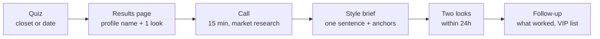
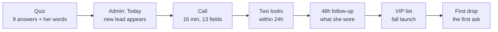

# NOCI Styling Playbook

2026-09-16 · Hanna

## How this playbook works

This is the one document a NOCI stylist needs to take any woman from quiz to two finished looks in 24 hours. It holds the house rules, the call, the look formulas, and a trend and stock layer that is refreshed on a schedule so the looks never point at sold-out pieces or last season's ideas.

Who uses it: the caller (market-research call), the stylist building the looks, and whoever writes the edit. Read sections 2 to 6 once. Sections 7 to 10 are the parts that change; check them before every look.

| Layer | What changes | Refresh | Owner |
| --- | --- | --- | --- |
| Principles, protocol, call, formulas (sections 2 to 6) | Rarely; edit inline when a rule proves wrong on calls | As needed | Hanna |
| Trend outlook (section 7) | New trends in, dead ones out, links and prices re-checked | Weekly, Monday | Claude (scheduled) |
| Seasonal calendar (section 8) | Next month's push moves to the top | 1st of the month | Claude (scheduled) |
| Stock and price check on every linked piece | Sold-out and final-sale flags, price drops | Weekly, with the trend pass | Claude (scheduled) |
| Reference library (section 10) | New icons and stylists as clients name them on calls | After each batch of calls | Stylist adds inline |

Every refresh is dated at the top of its section. If a section's date is older than its refresh window, treat its links as unverified.

## Styling principles

Seven house rules, carried over from the Intentional Glamour study and the Edit system prompt. Every look is checked against them before it goes out. The client should be remembered before the stylist.

| Principle | What it means on a NOCI look |
| --- | --- |
| Identity before inventory | Ask who she wants to be and how the day needs to feel before naming a single piece. The quiz answers and the call give you this. |
| Amplify, never conceal | Build around the feature, line, or color she already loves. Her body is not a correction project. Fit is described as what the garment does, never as a judgment. |
| One clear story | Every look reinforces one sentence. Clothes, shoes, bag, and beauty direction all point the same way. |
| One hero, one echo | Pick one hero: color, silhouette, surface, skin, or accessory. A second element may echo it. Everything else goes quiet. |
| Controlled contrast | Polish plus one destabilizer: scale, shine, skin, color, texture, or an unexpected reference. Never two. |
| Range without randomness | Looks can change era and silhouette between calls, but her through line stays visible. Look 1 and Look 2 should feel like the same woman. |
| Joy with rigor | Experiment in the idea, then edit hard. Fit, movement, weather, and whether the piece is actually in stock are non-negotiable. |

**Balance rules that follow from the hero.** Complex shape needs simpler color and jewelry. Dense shine or embellishment needs cleaner hair and accessories. Intense color needs a decisive line and a narrow supporting palette. Major jewelry needs open space around the face or neckline. When skin is the focal point, raise precision elsewhere with tailoring, length, or material. If the skirt is full, the top is fitted.

**Language rules for anything she sees or hears.** Say stylist, pick, look, and works with. Never say algorithm, AI powered, elevated separates, or curated collection. Styling is included; free is never the headline. Use lived-in language over occasion categories: her Tuesday work look, not officewear. No urgency tactics.

**Quality check before a look leaves.** Score it 0 to 2 on identity, intention, coherence, proportion, function, feasibility, and creative expansion. Below 11 of 14, revise. A zero on function or feasibility blocks the look.

## Style anyone: the client protocol

Any woman who finishes a quiz gets a 15-minute call and two complete looks within 24 hours of that call. The quiz gives the taste read, the call gives the life, the stylist turns both into looks. Nothing is sold at any step during the test phase.

The caller writes the brief straight after the call. The stylist builds from the brief, not from the raw call notes.

| Step | Who | Time budget | Output |
| --- | --- | --- | --- |
| Quiz | She | 2 to 3 min | Answers, profile name (for example The Easy Camel), one previewed outfit, three held outfit titles, four sealed style lines |
| Call | Caller | 15 min | Call notes in the section 4 order, spend number, VIP opt-in |
| Brief | Caller | 5 min after the call | One-sentence story, three anchors, three boundaries, constraint map (section 5) |
| Looks | Stylist | 30 to 45 min per client | Two looks in the section 6 format, every link checked live that day |
| Delivery | Stylist | Within 24 h of the call | Text or email, plus the edit link when a look uses NOCI |
| Learn | Stylist | 48 h later | One line: what she wore, what she skipped, why. Goes on her profile |

**The two looks are not the same look twice.** Look 1 solves the thing she named on the quiz or the call. Look 2 is the controlled experiment: same woman, one proportionate step further (a color, a shape, a texture). Both use her closet first, then under-$100 buys from section 7, then NOCI where the piece exists.

**Pick-anyone rule.** If you can name her one-sentence story, her hero, and one thing she must be able to do in the outfit, you can style her. If you cannot, you are missing a call note, not a product.

## The lead flow

Right now the flow gathers information and goodwill, not orders. Each quiz gives us six to nine answers and a free-text line before anyone speaks; the call adds 13 fields; the looks and the follow-up tell us what she actually wears and spends. Selling starts only when the VIP list gets the first drop this fall. Every stage below says what we capture, what she gets immediately, what feeds it, and what we learn.

**What the admin captures, read on 16 September 2026.** Eight pages. The lead page is the call sheet and the write-up form is where the research lands; everything else is plumbing.

| Admin page | What it holds | Who uses it |
| --- | --- | --- |
| [Today](https://intheb.ag/admin/today) | Today and tomorrow in call order: time, stylist, first name, her number with Zoom Phone and tap-to-call, the three texts, state (booked, done, not written up), open her page | The caller, every morning |
| [Leads](https://intheb.ag/admin/leads) | Newest first: came in, first name, quiz variant (control, the-closet, the-date, the-dress-code, the-size-chart), prep scores, status, stylist, latest booking, marketing list yes or no, a flag when she wrote in her own words | The caller, to pick who is next |
| Lead page, before the call | Two scores that gate the rest: do her answers tell you enough to plan the call (1 to 4), could you deliver her four rules as written (1 to 4). Then her quiz variant and the exact landing copy she saw, the point (one outfit, sorted), in her words, four sealed rules each with a rewrite button, the call clock, her answers by block (looks, colour, height, where her length sits, fit, what is coming), attribution (source, campaign, content, hook, creative, landing page), phone and email, consent by channel with version and date, bookings with a move-it link, the three texts | The stylist, five minutes before dialing |
| Lead page, write-up after the call | Was the sheet right about her (1 to 4). The minute-13 answer: if the pieces you need were at one label, would you want them (all of it, one piece, later, no), and the piece she named. Most and least useful question. What was missing and what you had to ask (sizes, brands, budget, closet, occasion, date, photos, other). A free note | The stylist, within five minutes of hanging up |
| [Results](https://intheb.ag/admin/quizzes) | The A/B read: views, starts, completes, sealed, ask seen, scheduler, leads, booked, completed, show rate, prep scores, call score, override, words filled, calls today against a target of 12. Per variant: missing top three, had to ask top three, questions that earned their place, intent. Decision rule: promote a variant only at 20 rated calls per cell and 0.8 points over control | Hanna and Krish, weekly |
| [Availability](https://intheb.ag/admin/slots) | 15-minute slots, 9 am to 4 pm PT, assigned to any stylist | Whoever owns the calendar |
| [Photos](https://intheb.ag/admin/photos) | 32 option tiles and 40 first-look images, 3 by 4, swappable without changing copy | The merchandiser |
| [Stylists](https://intheb.ag/admin/stylists) and [Houses](https://intheb.ag/admin/houses) | Stylist profiles (name, role, bio, trained, known for, years, photo; only active ones show publicly) and verified houses as wordmarks only. Both empty today | Hanna |
| [Settings](https://intheb.ag/admin/settings) | Timezone, reply-to, team email for every booking and move, GA4 and Meta pixel IDs | Hanna, once |

**Where the flow stands today.** Control is the only live variant; the closet, the date, the dress code and the size chart are drafts waiting on their ad sets. In the window since 4 September the control funnel reads as below. Five real leads have booked since 4 September, and none has been scored or written up, so the Results page cannot read anything yet.

| Control funnel, 4 to 16 September | Count |
| --- | --- |
| Landing views | 35 |
| Quiz starts | 19 |
| Quiz completes | 6 |
| Sealed results seen | 6 |
| Scheduler opened | 5 |
| Booked calls | 2 |
| Calls completed | 1 (the test lead) |
| Calls scored or written up | 0 |

**What the admin changes in this playbook.**

1. The call has a clock the site already promises her: minutes 0 to 3 her read and the four rules aloud, 3 to 10 look one rebuilt from her closet, 10 to 13 look two, minute 13 the one-label question. Section 4 asks its questions inside that clock, not instead of it. Open decision: the call sheet builds both looks live, while the delivery promise is two looks within 24 hours. Treat the call as the sketch and the 24-hour message as the finished version.
2. Score before you dial, every time. The two prep scores are the market research on the quiz itself; the Results page needs 20 rated calls per cell before it can say whether the closet or date quiz beats control.
3. The minute-13 answer is the only sales signal we collect and it is asked as research, not as a pitch. Tally it by profile name each week. It is the first-drop demand forecast.
4. The write-up fields (what was missing, what you had to ask, most and least useful question) are the feedback loop for the quiz. When the same thing is missing three calls running, that becomes the next quiz question or the next call-script line.
5. The texts go from the stylist's own phone, three at most, naming the outcome and never the method. The tip bank supplies the outcome lines.
6. The control quiz asks different questions from the closet and date quizzes (a white-fabric colour test, height and where her length sits, where clothes fit wrong, what is coming), so section 5's profile grids apply only to the two draft variants until they go live.

**Fix this week.** Score and write up the five booked calls. Add at least one stylist profile, since the public site shows none. Fill team email and the pixel IDs if they are blank. Decide whether the closet and date ad sets go live now or after 20 rated control calls.

**Stage by stage.**

| Stage | What we capture | What she gets right away | What feeds it | What we learn for the business |
| --- | --- | --- | --- | --- |
| Quiz, closet | Wish, style, palette, prints, silhouette, where it needs help, what is missing, body shape, in her words | Profile name, one outfit preview with labeled pieces, three held outfit titles, four sealed rule titles | The 16 outfit previews (swap photos at admin/photos), the profile grid in section 5 | Which wishes and palettes dominate; which profile names convert to a booked call |
| Quiz, date | Occasion, how far out, palette, fear, look, feeling, what matters, in her words | Same as above, built for the occasion | The 24 occasion-by-palette previews | Which occasions are coming and when; the fear split (under vs overdressed) |
| Call | Occasion and date, three feeling words, icon, what she wears and never wears, brands she buys and brands she wishes she could, must-be-able-to, boundaries, experiment axis, fit notes, monthly spend, where she buys, VIP yes or no, channel | Her four rules read aloud, the color rule from section 9, one pairing walked piece by piece | Section 4 script, the tip bank, the stylist intelligence tab | Spend band and retailer set, the brands she buys against the brands she aspires to (the gap between the two is the price point and the positioning), the icon list, the language she uses for her problem |
| Two looks | Which pieces went in, which trends, which retailer, price per look, NOCI piece yes or no | Two complete looks, two adjustments, practical notes, the edit link when NOCI is in it | Section 6 formulas, section 7 trends, the edit, the lookbooks | Which trends and price points a real client accepts; where NOCI has no piece to offer |
| 48-hour follow-up | What she wore, what she skipped, why, one line in her words | A reply, and the held third look if she wants it | The client file | The conversion signal before there is anything to convert to |
| VIP list | Opt-in, channel, everything above on file | Early sales, first drops, styling stays comped | The launch calendar | The first buyer list and what each will pay for |

**What we give away, and what we hold.** Given free and immediately: the profile name, one full outfit, the call, two looks, the color rule, the four rules spoken. Held for the relationship: the third look, the written version of anything (nothing is emailed as a PDF), and the edit link only when a look uses a NOCI piece. Never given in the test phase: a product pitch, a discount, urgency.

**What to roll up every week from the admin.** Count of quizzes by type. Distribution of wish, palette, silhouette, body shape, fear, occasion. Calls booked and held. Looks delivered on time. Looks worn per the follow-up. VIP opt-ins. Spend band by profile name. Icons named, tallied. Retailers named, tallied. Trends that went into looks and were worn. Every one of these is a number a merchandiser or a launch plan can use; the quiz is the market research.

**How the flow improves itself.**

1. Profile names that never book a call get their outfit preview swapped at admin/photos and re-tested for two weeks.
2. Every call adds one line to the tip bank when a client says a problem in a new way. The tip bank is the script by month three.
3. Every look that gets worn moves its trend up in section 7; a look that is skipped twice for the same reason gets its formula rewritten in section 6.
4. Spend bands from the call set the price points for the first drop. Retailers named set the competitive shelf.
5. Icons named on calls that are not in section 10 get added on the 15th by the stylist-intel job.
6. Pieces NOCI could not offer become the vendor ask list, in the same shape as the hot-list asks: silhouette, color, category.

**Metrics per stage, in order.** Quiz started, quiz finished, phone given, call held, brief written within 5 minutes, looks sent within 24 hours, follow-up answered, look worn, VIP opted in. Track the drop between each pair; the biggest drop is the week's work.

**The competitor funnels at each step.** Checked 16 September 2026 from each brand's own pages and help centers. Only Nordstrom and Daydream give value before money; only Nordstrom and Wishi's top tier put a voice on the line; nobody offers a free call with a stylist who owns the label.

| Who | Data before any value | Given right away | First money ask | Human | Follow-up |
| --- | --- | --- | --- | --- | --- |
| [Stitch Fix](https://support.stitchfix.com/support/solutions/articles/153000250371-how-the-fix-experience-works) | Style, size, budget, height and weight, body type, outfit ratings | A stylist match and a first-box offer, nothing visual | $20 styling fee per box, credited to keeps; 5-item box | Human, async notes; messaging replies in a couple of days | Boxes every 2 to 3 weeks up to quarterly, preview email before ship |
| [DailyLook](https://www.dailylook.com/g/box-service-faq/2412.html) | About 35 questions: sizes, bra size, DOB, occupation, spend per category, social handles, then a card | A promo on the first fee | $40 fee charged when curation starts; 7 to 12 items from $60 | Dedicated human, by email; preview to swap items | Monthly to quarterly, 5-day returns |
| [Wishi](https://www.wishi.me/pricing) | 4-step needs, department, body type, style; full quiz only after booking | Stylist profiles and response times; nothing styled until paid | $60 Mini, $130 Major, $550 Lux, before any board | Human chat; calls only on the $550 tier | Sessions expire in 3 months; paid monthly membership for advice between |
| [Daydream](https://daydream.ing/) | Name and department, then optional sizes, price range, brands; no card ever | Instant shoppable results across 10,000 brands | Never asks; commission on retailer checkout | None, AI only | Profile learns from saves and clicks |
| [Style DNA](https://apps.apple.com/us/app/style-dna-ai-stylist-closet/id1358319821) | A selfie, then a quiz | A season and style label; the palette itself is behind the paywall | $7.99 to $19.99 a month right after the analysis | None, chatbot | Five daily outfits from her closet |
| [Cladwell](https://cladwell.com/pricing) | Account, 5-minute quiz, then she builds her closet | Style descriptors, capsule templates, daily weather outfits; free tier | Under $5 a month on site, up to $59.99 a year in the app; sells no clothes | None; ChatGPT-based ask | Daily outfits and cost-per-wear stats |
| [Nordstrom](https://www.nordstrom.com/browse/services/personal-stylists) | Focus area, then a Nordstrom sign-in before the request form | A stylist-curated board by email, about 9 items, no fee | A normal order, no pressure to buy | Human, by call, email, Zoom or in store | Alternates sent same day when something does not fit |
| NOCI | 9 quiz answers and a phone number; no account, no card, no photo | Profile name, one full outfit, three held titles, four sealed rules, then a call | None in the test phase; the first drop reaches the VIP list this fall | Human, by phone, free, and it stays free | Two looks in 24 hours, a 48-hour check-in, the held third look |

**What to take from them.** Stitch Fix and DailyLook prove women will answer 30 questions and hand over a card for a human; we ask 9 and take nothing, so the call must carry the value they get from the box. Nordstrom's board by email is the closest thing to our two looks; ours arrive faster and come with a voice. Wishi's $60 to $550 is the price of what we give free, which is the line to use when the sale eventually comes. Daydream and Cladwell are where a client goes when nobody will talk to her; that is the gap the phone fills.

## The call

Fifteen minutes, in your own voice, nothing to sell. The call exists to get five things the quiz cannot: her life, her icon, her closet, her spend, and permission to keep talking to her. Have her quiz results open before you dial.

**Open (1 min).** "I'm following up on the quiz you took. I have nothing to sell you. We're gathering market research and giving you something useful for your time: two free looks from our stylists, built on this call, in your inbox within 24 hours."

**Read back her profile (2 min).** Say her profile name and the one-sentence read the quiz gave her. Ask if it landed. Her correction is the most valuable sentence of the call; write it down verbatim.

**Ask, in this order (9 min).** Skip any question whose answer will not change the looks.

1. What is coming up in the next month that you want to feel great for? Where, when, who is there?
2. How do you want to feel walking in, in three words?
3. Who is your style icon right now? Anyone whose wardrobe you would take whole? (Note the name; section 10 maps it to a formula.)
4. What do you already own that you reach for every week? What have you bought and never worn? And which brands do you like, the ones you actually buy and the ones you wish you could?
5. What must the outfit let you do comfortably? Sit, walk far, nurse, chase kids, stand for hours?
6. Anything off the table: colors, fabrics, exposure, heel heights, dress codes?
7. Which one do you want to move this time: color, shape, texture, or accessories?
8. Body check, only if she picked a shape on the quiz: which cuts fit well now and which never do? Never diagnose. Ask what the garment does.

**When she doesn't know, offer options and keep probing.** "I don't know" is never the end of a question. Turn it into a choice of three or a yes-or-no run, and keep going until you have a concrete answer. Closet: "Do you own a black slip dress, a blazer that fits at the shoulder, a satin midi, a heel you can stand in for four hours?" Feeling: "Hot in what way: leg, back, shoulder, or the waist?" Icon: "Hailey on a Tuesday or Hailey at an event?" Color: "What color do you get complimented in?" Occasion: "What did you wear to the last one, and did you feel right in it?" She should never have to generate; she only has to pick.

**Spend (1 min).** After you have enough, ask plainly: "Roughly what do you spend on an outfit in a typical month?" Then: "Where do you buy most of it?" Record both numbers, no reaction.

**Close (1 min).** Confirm the delivery channel and the 24-hour window. Optional VIP line: "We're launching a woman-led retail company this fall. You're on the VIP list, which means early sales, first drops, and the styling stays comped."

**Call notes template.** Fill this before the next call.

| Field | Write | Blocks the send if empty |
| --- | --- | --- |
| Profile name | From the quiz results, plus her correction |  |
| Occasion, date, place, dress code | One line per event if it is a weekend | Yes |
| Vibe, in her words | Three feeling words plus the sentence she said unprompted, verbatim; it becomes the look title | Yes |
| Taste probe | Six directions: hell no, sometimes, love it | Yes |
| Where she buys | The brands she names, kept separate from taste |  |
| Icon, and which half | Which icon is the shape and which is the finish |  |
| Sizes | Dress, top, bottom, shoe, bra if the neckline needs it; plus what always runs long or tight | Yes |
| Colours: loves, hates, complimented in | Three short lists; the hate list matters most | Yes |
| Owns, in play | Yes or no down the fixed list: black slip, satin midi, blazer that fits at the shoulder, strapless or corset top, a heel she can stand in, leather or suede jacket, jeans she loves, a going-out bag | Yes |
| Owns and never wears | One item and why |  |
| Budget per look | A number, and whether resale, rental, or tailoring is fine | Yes |
| Must be able to | Dance, stand, sit, travel; write it even if she says she does not care |  |
| Off the table | Exposure, heel heights, fabrics, anything she never wears |  |
| The finish gap | Hair, makeup, or shoes: which went wrong last time |  |
| Monthly outfit spend, where | The research questions, two answers |  |
| Minute 13, one label | All of it, one piece, later, or no |  |
| VIP, channel | Yes or no; text or email and the address |  |

**Do not.** Do not name a product on the call. Do not say free more than once. Do not promise a PDF; the four sealed lines are read on the call only. Do not comment on her body.

## Reading a profile

The quiz already encodes most of the brief. The Closet quiz names her profile from style plus palette (16 names), and picks her previewed outfit from palette plus silhouette (16 outfits). The Date quiz names her from look plus feeling (16 names) and previews from occasion plus palette. Learn the two grids and you can read any result in ten seconds.

**Closet quiz: profile name by style and palette.**

| Style | Warm (camel, cream, chocolate) | Cool (black, white, grey) | Jewel (emerald, sapphire, wine) | Soft (blush, sage, powder blue) |
| --- | --- | --- | --- | --- |
| Effortless, down to earth | The Easy Camel | The Off-Duty Minimalist | The Low-Key Jewel | The Quiet Confidence |
| Confident and bold | The Warm Statement | The Sharp Monochrome | The Modern Bold | The Soft Power |
| Classic and elegant | The Polished Classic | The Clean Line | The Deep Heirloom | The Gentle Tailor |
| Urban, cool girl | The Downtown Neutral | The City Uniform | The Street Gem | The Soft Edge |

**Date quiz: profile name by look and feeling.**

| Look | Effortless | Polished | Best version of myself | Comfortable first |
| --- | --- | --- | --- | --- |
| Classic and tailored | The Offhand Classic | The Sharp Guest | The Finest Cut | The Lived-In Tailoring |
| Easy and relaxed | The Light Touch | The Soft Polish | The Good Day | The Unbothered |
| Bold, statement-making | The Accidental Headline | The Set Piece | The Big Entrancer | The Loud Comfort |
| Romantic and feminine | The Easy Elegance | The Composed Romantic | The Full Bloom | The Soft Landing |

**What each quiz answer tells the stylist.**

| Quiz field | Use it as |
| --- | --- |
| The wish (closet) or the fear (date) | The problem Look 1 must solve. "What goes with what I own" means closet-first; "what I should stop buying" means name the shape to retire; "underdressed" or "overdressed" sets the dial for the whole look. |
| Palette | Her three working colors. Section 9 tells you which one goes next to her face. |
| Prints | Solid is the default hero-free base. A print pick becomes the one destabilizer. |
| Silhouette (closet) or look (date) | The dominant line. Fitted, relaxed, structured, or flowy each carries its own proportion rule in section 2. |
| Where it needs help | Which occasion Look 1 is for when the call gives no date. |
| What the closet is missing | Statement-piece answer means Look 2 introduces one; basics answer means Look 2 is three quiet pieces. |
| Body shape | Which cuts to open with. Speak only in garment terms. |
| The feeling (date) | Her three feeling words, already given. |
| What matters (date) | Where the money goes: the exact look, confidence, investment pieces, or ease. |
| In your words | Read it twice. It is often the whole brief. |

**The brief.** Write it in this shape before building anything: "Today she is showing up as \[identity\] for \[context\], so we will use \[visual mechanism\]." Then three anchors (what already feels like her), three boundaries (what is off the table), and the constraint map (weather, movement, duration, budget, delivery date). Add her icon from the call and the formula it points to in section 10.

## Building the two looks

A look is a hero, a line, three working colors, and a shoe. Choose those four, then fill in. Look 1 solves her stated problem in her stated silhouette. Look 2 keeps her through line and moves one thing along the axis she picked on the call.

**Six formulas that cover every profile.** Start from the row that matches her silhouette or look, then apply her palette.

| Formula | Build | Best for |
| --- | --- | --- |
| Modern column | One color head to toe, body-skimming long line, open neckline, one sculptural earring, clean hair | Fitted, Classic, Bold. Any date look. The Clean Line, The Sharp Monochrome, The Finest Cut |
| Incidentally polished | Excellent trouser or denim, fitted knit or crisp shirt, elongated coat, fashion shoe, one playful mismatch | Relaxed, Urban. The Easy Camel, The City Uniform, The Light Touch |
| One fitted thing | Everything relaxed except one piece that holds a line, usually the shoe or the top | Relaxed, Flowy, Comfortable-first. The Unbothered, The Off-Duty Minimalist |
| Heritage set | Matching or near-matching top and bottom, broken by one plain piece and a pointed shoe | Structured, Classic. The Polished Classic, The Gentle Tailor, The Sharp Guest |
| Controlled spectacle | One surface or scale event (sequin, fringe, suede, animal print), minimal competing color, small bag, no second story | Bold. The Modern Bold, The Set Piece, The Big Entrancer, The Accidental Headline |
| Soft and sharp | One soft piece against one sharp piece: a floaty midi with a flat boot, a ruffle blouse with straight jeans | Flowy, Romantic. The Full Bloom, The Soft Edge, The Composed Romantic |

**Proportion rules that never move.** Full skirt, fitted top. Wide trouser, hem on or over the shoe. Relaxed everything needs one fitted thing. Complex shape gets quiet color. One print, and repeat one of its colors somewhere else. Two trend signals maximum per look; a third reads as costume.

**Taste probe before sourcing.** The brands she names are where she shops, not what she likes. Hanna's own test proved it: Zara, Lovers and Friends and Revolve on the call, and a mood board of The Row, Saint Laurent, Gianvito Rossi and 90s Kate Moss when the looks came back wrong. Before a single link goes in a look, show her six style directions as image grids and ask hell no, sometimes, or love it: quiet tailoring, slip and blazer, body-led column, denim off duty, romantic boho, sheer night out. Two minutes, and it says more than any question. Then source the aesthetic she loved at the price band she named. Ask for one screenshot of a look she has saved; it replaces the probe entirely.

**The mood board she gets.** Not a grid of product tiles. A collage on paper: five to seven cutouts of the actual pieces, scattered and overlapping the way a stylist lays them on a table; one editorial reference photo, the icon or the era, not a celebrity in a customer-facing send; five palette dots down the left edge in the order they sit on the body; a price card for the two pieces that carry the money; one handwritten-feeling line, the look's sentence. Product cutouts come from the retailer's flat shots with the background dropped. The board goes at the top of the send, before any words.

**Sourcing order for every piece.** Her closet first (the three things she wears most). Then tailor or restyle what she owns. Then the under-$100 buys in section 7. Then NOCI, when the piece exists on the site and the color is right. A new buy must repeat across at least three outfits unless it is the one statement she asked for.

**Delivery format.** One message, two looks, same structure each time. Send by the channel she chose within 24 hours of the call.

1. One line of point of view, in her words from the call.
2. Look 1, titled. Five pieces at most, each labeled top to shoe with the color and where it comes from: yours, tailor, a linked buy under $100, or NOCI. One sentence on why it works for her.
3. Look 2, titled. Same format. One sentence on what moved and why.
4. Two adjustments: one quieter, one bolder.
5. Practical notes: weather, movement, the one thing to check on fit.
6. The edit link when a look uses a NOCI piece. Nothing else to buy, nothing urgent.

**How it reaches her.** A text with one picture of the board and one link, then the email as the copy she keeps, within the hour. No PDF unless she asks. The link is her page: two looks, the held third, every piece with a photo, price and link, the finish for each. The reasoning and the sources are in the funnel doc under the seven touches; the stylist app produces the text, the email, the board picture, her page and a PDF from the looks screen.

**Before it goes.** Every link opened that day. Sizes in stock in her size. No final-sale piece unless she said she is certain of size. Section 2 score of 11 or above. A second stylist reads it for 60 seconds.

## Trend outlook, Fall 2026

Last checked 2026-09-16. Eleven trends, ranked by how often they will land on a call. Prices are from this week's shopping guide and are re-verified on the Monday pass; anything flagged almost gone or final sale is re-checked the day it goes into a look. Two trends max per look.

**1. Maxi skirts.** Floor-grazing in plaid, denim, satin slip, and knit; the deepest under-$100 category. Heritage prep: plaid maxi, relaxed button-down, leather accessories, suede boot. Softer: satin slip maxi, chunky knit, flat boot. Full skirt, fitted top.

| Piece | Retailer | Price | Note |
| --- | --- | --- | --- |
| Plaid Maxi Handkerchief Skirt | Gap | $99.95 | In stock |
| Maxi Slip Skirt, burgundy | Gap | $47 | Product page price; grid shows $79.95 |
| CashSoft Rib Sweater Maxi | Gap | $63 | Knit |
| Denim Seamed Button-Front Maxi | Gap | $64.99 | Denim |
| 100% Cotton High Rise Plaid Maxi | A&F | $63 from $90 | Blue and brown plaid, Petite to Tall, XXS to XXL |
| Merino Wool-Blend Sweater Maxi | A&F | $100 | XXS to XXL |
| 100% Cotton Boho Maxi | A&F | $71.25 from $95 | Brown and light-blue plaid |
| House of Harlow Whittney Maxi | Revolve | $54 from $168 | Espresso, not final sale |
| Lovers and Friends Cassie Maxi, black | Revolve | $47 | Final sale |

**2. XL belts.** An extra-wide belt giving shape to something loose. Belt a maxi dress or long coat at the natural waist in a coordinating shade. The cheapest way to make something she already owns look styled, so the highest-value trend for a call.

| Piece | Retailer | Price | Note |
| --- | --- | --- | --- |
| Good American Wide Studded Western Belt | Revolve | $61 from $99 | Closest to a true wide belt under $100; restocking mid-October |
| 90s Chunky Belt | A&F | $40 | Buffalo leather, 4 colors; narrower than the trend photo |
| Suede Belt | A&F | $50 | Real suede, bestseller; doubles as trend 3 |
| Jaslynn Faux Suede Belt | Princess Polly | $25 | S/M and L/XL; cheapest way in |
| Leather Plaque Buckle Belt | Zara | $49.90 | 3 cm wide, a statement buckle not a wide belt; few left |

**3. Suede staples.** The signature fall texture; looks expensive even when it is not. One suede piece, everything else fluid: a suede shirt jacket with satin or balloon-leg trousers in a close shade. Tonal, not matchy.

| Piece | Retailer | Price | Note |
| --- | --- | --- | --- |
| Vegan Suede Shirt Jacket | A&F | $140 | XXS to XL; most versatile piece here |
| Low Rise Vegan Suede Midi Pencil Skirt | A&F | $90 | Almost gone |
| Slouchy Vegan Suede Tote | A&F | $90 |  |
| All The Ways Milana Faux Suede Coat | Revolve | $68 from $146 | Longline coat |
| Ellissa Faux Suede Bomber | Princess Polly | $94 | All sizes; relaxed drop shoulder, reads oversized; brown and zip-through versions |
| Faux Suede Fringe Jacket | Zara | $79.90 | Covers suede and fringe at once |

**4. Animal print.** Leopard and zebra as a neutral, not a statement. Put one real color against it: red, chocolate, or black. Leopard coat over a plain black base, or a leopard midi with a solid knit. The second piece stays completely quiet.

| Piece | Retailer | Price | Note |
| --- | --- | --- | --- |
| Animal Print Tie-Detail Midi Skirt, zebra | Zara | $39.90 | If she buys one thing off this list, this is it |
| Animal Print Tulle Skirt | Zara | $39.90 | Leopard/taupe and black/white |
| superdown Marleigh Maxi Dress | Revolve | $59 from $98 |  |
| Bardot Monroe Leopard Maxi Skirt | Revolve | $59 from $129 |  |
| superdown Larkin Leopard Mini Skirt | Revolve | $54 | Preorder, restock mid-October |
| Eleganza Maxi Skirt and Top | Princess Polly | $59 and $55 | Skirt sold out in US 4 and 6; also Petite and Curve |
| GUIZIO x Revolve Nea Printed Top | Revolve | $49 from $148 | Final sale, only if certain of size |

**5. Casual tailoring.** Tailoring loosened up: tweed sets, soft blazers, matching skirt and coat. A tweed mini with its jacket, broken by a fitted tee or thin knit and a pointed pump. One tweed blazer over jeans does most of the work.

| Piece | Retailer | Price | Note |
| --- | --- | --- | --- |
| More To Come Ashtyn Tweed Blazer | Revolve | $89 from $98 | Only 1 left; cream multi |
| More To Come Ashtyn Tweed Mini Skirt | Revolve | $54 | Listed in baby pink; confirm colorways before styling as a set |
| Gold Button Rib Knit Cardigan and Ribbed Knit Midi Skirt | Zara | $45.90 and $49.90 | A true matching set, about $96; easiest co-ord here |
| Textured Fringe Blazer | Zara | $109 | Doubles as trend 7 |
| More To Come Nalia Blazer | Revolve | $33 from $84 | On the brand page |

**6. High-low dressing.** Polished mixed with off-duty: trench over a tee and shorts, finished with heels and a good bag. Pick two anchors first, one polished and one casual, then keep the rest plain. The trench and the bag are where the money goes.

| Piece | Retailer | Price | Note |
| --- | --- | --- | --- |
| Icon Trench Coat | Gap | $117 from $168 | Water repellent, XXS to XXL in Regular, Tall, Petite; most size-inclusive trench |
| Belted Midi Trench, cool brown | Gap | $103 from $148 |  |
| Short Pleated Trench, sand | Zara | $99.90 | 100% cotton; the only true trench under $100 |
| Westwind Trench, black | Princess Polly | $105 | XS and S sold out |
| Carrie Long Trench | A&F | $170 | 4 colors including tan plaid |
| Vegan Suede Long Trench | A&F | $220 | One piece, two trends |
| Wool-Blend Plaid Trench, brown houndstooth | Gap | $200 from $298 |  |

**7. Statement fringe.** Fringe that moves, on tops, jackets, skirts, and bags; it photographs because it does something when she walks. One fringe piece is the whole outfit: fringe top with straight trousers and a heel, or a faux-suede fringe jacket over a plain dress. No other texture, no print.

| Piece | Retailer | Price | Note |
| --- | --- | --- | --- |
| More To Come Bella Faux Suede Fringe Jacket | Revolve | $53 from $98 | Best value on the list; preorder, ships mid-September |
| Fringe Shoulder Bag | Zara | $59.90 | In stock; lowest-risk way in, no fit question |
| Faux Suede Fringe Jacket | Zara | $79.90 | Fringe and suede at once |
| Linen Fringed Midi Skirt | Zara | $79.90 |  |

**8. '70s boho.** Ruffled blouses, floaty dresses, slouchy boots, oversized sunglasses. Two boho signals maximum, then ground it: ruffle blouse with straight jeans and a slouchy boot, or a floaty midi with a flat boot and big sunglasses.

| Piece | Retailer | Price | Note |
| --- | --- | --- | --- |
| Bardot Rosalo Ruffle Blouse | Revolve | $57 from $149 | Best ruffle blouse found |
| Boho Maxi Skirt, white lace trim | A&F | $76 from $95 | Petite to Tall; almost gone |
| Silver Soul Embroidered Maxi Skirt | Princess Polly | $65 | All sizes; most reliably available boho piece |
| Embroidered Maxi Skirt | A&F | $90 from $120 | Almost gone |
| Cotton Gauze Tiered Easy Maxi Skirt | Gap | $64.99 from $79.95 | In stock; easy and wearable |
| Oversized Aviator and Narrow Oval sunglasses | A&F | $95 each | Only live sunglasses source; Princess Polly sold out |
| More To Come Denise Ruffle Tie Top; Damson Madder Everly Ruffle Blouse | Revolve | $64; $61 |  |

**9. Daytime sequins.** A sequin skirt with something deliberately plain: a cozy sweater or sweatshirt in the same color family, full monochrome, flat boot or loafer. Monochrome is what makes it read intentional.

| Piece | Retailer | Price | Note |
| --- | --- | --- | --- |
| superdown Melie Sequin Maxi Skirt | Revolve | $58 | Preorder |
| SNDYS Asher Sequin Micro Mini, chocolate | Revolve | $89 | Chocolate is the day-wearable one |
| Runaway The Label Oceana Sequin Mini, pearl | Revolve | $99 |  |
| Sequined Knot Pareo (Marisa Berenson x Zara) | Zara | $79.90 |  |
| Deep clearance: A&F Sequin Maxi $44.97; PP Leslay Sequin Mini $17.50 (US 2 and 6 only); Zara sequin skirts $9.98 to $15.98 | Various |  | Final sale, broken sizes; only if she is flexible |

**10. Pops of chartreuse.** The acid green off the Fall/Winter 2026 runways (Balmain, Dior, Miu Miu, Prada, Ashlyn). Not buyable here yet. What to say: "Acid green is the color editors are watching, but it hasn't hit stores. The green that's actually buyable this fall is moss." If she loves the idea, put the pop in an accessory she can find, not a garment she cannot.

**11. Feathery accessories.** Feather clutches, frilly brooches, feather trim. Route her to vintage and resale, which is where this trend genuinely lives and a better story. Or substitute the texture: a fabric flower brooch (Zara, about $15) or a marabou-adjacent fringe piece gets the same finish at a price she will pay.

**Where to browse when a piece above is gone.** Gap long skirts (74 styles). A&F skirts, belts, and trenches. Revolve maxi skirts, belts, belt sale, and animal print. Princess Polly maxi skirts and the leopard lookbook. Zara animal print skirts and belts.

## Seasonal calendar

What to lead with each month from now to spring, and which trends from section 7 carry it. The monthly pass moves next month to the top and retires the one that passed. Dates she names on the call override this table.

| Month | Lead with | Trends that carry it | Occasions she will name |
| --- | --- | --- | --- |
| September 2026 | Transitional layers: trench over tee, maxi skirt with a fitted knit, one suede piece | High-low, maxi skirts, suede, XL belt | Back to work, first cool nights, early fall weddings |
| October 2026 | Full fall texture: suede, tweed sets, animal print as a neutral, boot season opens | Suede, casual tailoring, animal print, boho | Fall weddings, work events, Halloween-adjacent nights out, reunions |
| November 2026 | Rich color and polish: chocolate, wine, emerald; the first sequin-in-daylight looks; coats as the hero | Daytime sequins, XL belt, high-low, animal print | Thanksgiving, holiday party invitations arrive, Black Friday buys |
| December 2026 | Party dressing done as monochrome: sequin skirt with a knit, satin slip maxi, one surface event, small bag | Daytime sequins, fringe, controlled spectacle formula | Office holiday party, family gatherings, New Year's Eve |
| January 2027 | Reset looks from the closet: the three pieces she owns, one fitted thing, tailoring at the shoulder and hem | Casual tailoring, one fitted thing formula | Back to work, resolutions, closet clear-outs; spend is lowest, closet-first matters most |
| February 2027 | Warm color next to the face, red as the one pop, softer textures | Animal print with red, soft and sharp formula | Valentine's dinners, milestone birthdays, first spring-break planning |
| March 2027 | Lighter layers, the trench returns, boho signals soften into spring | High-low, boho, maxi skirts in gauze and satin | Vacations, spring weddings begin, the woman-led retail launch follow-through |

**Weather rule.** Ask where she lives on the call. A September look for Phoenix and a September look for Boston share a hero and a palette but not a fabric. Swap the material, never the story.

## Color analysis primer

The quiz gives her a palette of three. The call decides which one sits next to her face, which one sits at the hem, and which one is the accent. That is the whole color analysis, and it is one of her four sealed lines, so it is said on the call and written into the brief, never emailed as a chart.

**Read undertone in two questions.** Which looks better on you, gold or silver jewelry? Which do you reach for, a cream white or a bright white? Gold and cream lean warm; silver and bright white lean cool; if she cannot say, she is neutral and both palettes work with a small adjustment.

| Her palette | Next to the face | Below the waist | The accent | The trap |
| --- | --- | --- | --- | --- |
| Warm neutrals: camel, cream, chocolate | Cream if fair, camel if medium, chocolate if deep | Camel or chocolate as the anchor | Red, moss, or oxblood as the one pop | Camel next to a sallow face reads tired; move cream up and camel down |
| Cool neutrals: black, white, grey | The grey that clears the skin: charcoal if high contrast, dove if soft; black sits at the collarbone or lower on a soft coloring | Black as the anchor | Red, cobalt, or silver hardware | Head-to-toe black on low-contrast coloring washes her out; break it at the neckline with white or grey |
| Jewel tones: emerald, sapphire, wine | The one jewel that lights her: emerald on warm, sapphire on cool, wine on almost everyone | The other two, kept at the hem or the bag so they still get worn | Black or chocolate to ground | Two jewels at equal weight fight; one leads |
| Soft tones: blush, sage, powder blue | One darker piece next to the face holds it: charcoal, chocolate, or navy, then the soft tone below | Blush or sage as the volume | Cream, tan, or a metallic | All-soft reads as washed out; the darker frame is the fix |

**Four more palettes, used in the stylist app; the site quiz still offers the first four.** Each maps to one of the quiz families for the profile name and the first look, and carries its own rule.

| Palette | Family | Next to the face | Below the waist | The accent | The trap |
| --- | --- | --- | --- | --- | --- |
| Earth tones: olive, rust, terracotta | Warm | Olive on warm colouring, rust on deep | Chocolate or cream as the anchor | Terracotta | Two earth tones at equal weight read like a uniform; one is the hero |
| Brights: red, cobalt, hot pink | Jewel | Red on almost everyone, cobalt on cool, hot pink on warm | Neutral in her undertone | None; the bright is the accent and the whole piece | Two brights. Never |
| All black | Cool | Break it at the neckline with skin, a white tee, or one gold or silver piece | Black, in a different texture from the top | One matte against one shine: wool with satin, leather with knit | Head to toe in one texture reads flat; low-contrast colouring needs the break higher |
| Denim and white | Cool | White | Blue | Tan for the shoe, belt and bag | Loose on loose; one fitted thing against the denim. Navy is the dressed-up version |

**Applying it to a trend.** Animal print counts as a warm neutral; pair it with her one accent. Suede is warm by default; on a cool palette pick grey or black suede. Sequins take the palette's darkest color. Chartreuse and moss sit with warm and jewel palettes, not with soft.

**Say it like this.** "Cream is your face color. Camel is your bottom half. Chocolate is the coat and the bag. That's the whole rule, and you already own two of the three."

## Reference library

When she names an icon on the call, this table turns the name into a formula and a profile. Use it to translate, never to imitate: the mechanism is borrowed, the person is hers. Client lists are as reported by [Grazia](https://graziamagazine.com/me/articles/celebrity-stylists-fashion-inspiration/) where linked; every other client list was confirmed against an opened source on 16 September 2026, and the sources sit in the Stylist intelligence tab. Say "has styled", never "styles".

**Icons her clients will name.**

| Icon | The mechanism | Formula (section 6) | Profiles it fits | Age band she is usually in |
| --- | --- | --- | --- | --- |
| Hailey Bieber | Off-duty minimalism: oversized outerwear, a clean crop or tank, one sharp shoe, neutral palette | Incidentally polished | The Off-Duty Minimalist, The City Uniform, The Light Touch | 17 to 30 |
| Kendall Jenner | Model-off-duty column: straight trouser, fitted knit, a long coat, nothing loud | Modern column, Incidentally polished | The Clean Line, The Downtown Neutral | 20 to 35 |
| Kylie Jenner | Body-led glamour: fitted everything, one surface event, small bag, strong shoe | Controlled spectacle | The Sharp Monochrome, The Set Piece, The Big Entrancer | 17 to 30 |
| Zendaya | Range with a through line: era references, decisive silhouette, one hero per look | Controlled spectacle, Modern column | The Modern Bold, The Warm Statement, The Accidental Headline | 20 to 40 |
| Anne Hathaway | Fearless polish: graphic monochrome, high shine, dramatic proportion, precise tailoring | Modern column, Heritage set | The Polished Classic, The Finest Cut, The Sharp Guest | 30 to 60 |
| Olivia Rodrigo | Youthful edge: mini lengths, lace and rock textures, one playful reference, flat or platform shoe | Soft and sharp | The Soft Edge, The Street Gem, The Accidental Headline | 17 to 25 |
| Emma Stone | Quiet classic with wit: clean lines, jewel and warm tones, restrained accessories | Modern column, Heritage set | The Deep Heirloom, The Gentle Tailor, The Offhand Classic | 25 to 45 |
| Ashley Graham | Confident fit: body-skimming lines, a defined waist, deep color, an open neckline | Modern column, One fitted thing | The Warm Statement, The Soft Power, The Full Bloom | 25 to 45 |

**Stylists, and what each one teaches.**

| Stylist | Has styled | Take this from them |
| --- | --- | --- |
| [Law Roach](https://graziamagazine.com/me/articles/celebrity-stylists-fashion-inspiration/) | Zendaya, Anya Taylor-Joy, Priyanka Chopra | Every look tells one story; references are researched, then worn with total conviction |
| Erin Walsh | Anne Hathaway, Selena Gomez, Kerry Washington | Identity before inventory; amplify what she loves; the client is remembered before the stylist. This playbook's method comes from the study of her public work |
| [Mimi Cuttrell](https://graziamagazine.com/me/articles/celebrity-stylists-fashion-inspiration/) | Ariana Grande, Gigi Hadid | Lean into the client's individuality; street style that photographs |
| Rob Zangardi and Mariel Haenn | Jennifer Lopez, Gwen Stefani, Rachel McAdams, Rihanna | Glamour built on fit and a decisive silhouette; scale as drama |
| [Monica Rose](https://graziamagazine.com/me/articles/celebrity-stylists-fashion-inspiration/) | The Kardashian-Jenner sisters, Gigi and Bella Hadid, Chrissy Teigen, Kaia Gerber | Elegantly unbuttoned: playful proportion, complex textiles, one thing undone |
| [Dani Michelle](https://graziamagazine.com/me/articles/celebrity-stylists-fashion-inspiration/) | Kendall Jenner, Hailey Bieber | Minimal, neutral, artful; the shoe and the coat do the work |
| [Chloe and Chenelle Delgadillo](https://graziamagazine.com/me/articles/celebrity-stylists-fashion-inspiration/) | Olivia Rodrigo, Willow Smith | Experimental looks for Gen Z; one reference at a time |
| Solange Franklin Reed | Serena Williams, Zazie Beetz, Kerry Washington, Tracee Ellis Ross, Jodie Turner-Smith | Color and print with intention; cultural reference as the story |
| Danielle Goldberg | Ayo Edebiri, Greta Lee, Kaia Gerber, Olivia Rodrigo | Quiet, exact, modern; tailoring with one soft element |
| Joseph Cassell | Taylor Swift, Kerry Washington, Reba McEntire | A signature palette carried across eras without repeating a look |
| Andrew Mukamal | Margot Robbie, Mikey Madison, Hailey Bieber, Billie Eilish | Method dressing done with wit; a theme worn as fashion, not costume |
| Wayman Deon and Micah McDonald | Regina King, Tessa Thompson, Colman Domingo, Taraji P. Henson | Architectural shape and color that photographs from every angle |
| Rebecca Corbin-Murray | Florence Pugh, Gemma Chan, Lily James, Sophie Turner | Romantic softness sharpened by one strong line |
| [Jason Bolden](https://graziamagazine.com/me/articles/celebrity-stylists-fashion-inspiration/) | Vanessa Hudgens, Angelina Jolie | Monochrome and surface: one beaded or sculpted event, everything else clean |
| Petra Flannery | Emma Stone, Zoe Saldaña, Amy Adams, Renée Zellweger, Claire Danes | Classic proportion with a modern edge; jewel tones on a clean line |
| Emily Evans | Ashley Graham, Nicole Scherzinger, Kate Beckinsale (per her own site) | Color and texture first; the lived-in piece plus one couture-level surface. Evidence base is thin, treat as provisional |

**Age band notes from the audience map.** Six of ten comparison brands sit inside 20 to 45; only Eileen Fisher addresses 55 and up, only Cider and Edikted address 17 to 20. NOCI's real comparators are the single-label houses that carry a wide range in one visual language: Aritzia, COS, J.Crew, Eileen Fisher. One visual language, plural casting. When a client is outside 20 to 45, the formula does not change; the fabric weight, hem, and shoe height do.

What each stylist has said, their signature looks, and the call lines built from them: [Stylist intelligence](file/93045f88-939a)

## Why NOCI wins

Every competitor has a human stylist or owns the product, not both. NOCI has a free stylist by phone and its own label cut to order. The only structural limit is stylist hours, which is why this playbook exists: it makes every hour go further.

| Who | Human stylist | Owns the product | What blocks them |
| --- | --- | --- | --- |
| Stitch Fix | Yes, at scale | Mostly third-party | Margin goes to the brands and to return logistics |
| DailyLook | Yes | Third-party | Subscription framing caps the relationship and the order value |
| Wishi and Daydream | Yes, excellent | No product at all | They sell styling and earn nothing on the wardrobe |
| Style DNA and Cladwell | No, an algorithm | No | No human means no persuasion, no upsell, no relationship |
| Nordstrom | Yes, in store | Third-party, premium | Tied to stores, store hours, and premium prices |
| Typical DTC apparel | No | Yes | Sells one piece to a stranger and buys every order twice |
| NOCI | Yes, free, by phone | Yes, own label, cut to order | Nothing structural. The limit is stylist hours |

On a call, none of this is said. It shows up as the stylist knowing her closet, her call notes, and her looks the next time she rings.

## Links and tools

| What | Where | Use it for |
| --- | --- | --- |
| Closet quiz | [intheb.ag/the-closet](https://intheb.ag/the-closet) | Nine questions; the everyday client |
| Date quiz | [intheb.ag/the-date](https://intheb.ag/the-date) | Eight questions; the occasion client |
| Quiz photos admin | [intheb.ag/admin/photos](https://intheb.ag/admin/photos) | Swap the outfit preview images |
| The edit, shop the look | [the-edit-shop-the-look](https://the-edit-shop-the-look.hannacocoa.chatgpt.site/) | The linked five-piece look to send when a NOCI piece is in Look 1 or 2 |
| NOCI store | [shopnoci.com](https://shopnoci.com) | Check the piece exists in her color before it goes in a look |
| Audience map | [Google Slides](https://docs.google.com/presentation/d/18rWwqM5VYAvNA_m0CwFNQjUdsncStcnQDKO36PGvPBg/edit?usp=sharing) | Age bands, comparator brands, imagery rules |
| Best celebrity stylists | [Who What Wear](https://www.whowhatwear.com/best-celebrity-stylists) | Client lists to confirm before quoting |
| Anne Hathaway style evolution | [Elle](https://www.elle.com/fashion/celebrity-style/g71139883/anne-hathaway-style-evolution/) | Reference for the Polished Classic and Finest Cut profiles |
| Celebrity stylists for inspiration | [Grazia](https://graziamagazine.com/me/articles/celebrity-stylists-fashion-inspiration/) | Source for the stylist table |
| Source method | Intentional Glamour Style Playbook and the Edit system prompt, in Documents/Codex/2026-09-08 | Where sections 2, 5 and 6 come from |

**Admin, sign-in required.** [Today](https://intheb.ag/admin/today) for the call list, [Leads](https://intheb.ag/admin/leads) for everyone, [Results](https://intheb.ag/admin/quizzes) for the A/B read, [Availability](https://intheb.ag/admin/slots), [Stylists](https://intheb.ag/admin/stylists), [Houses](https://intheb.ag/admin/houses), [Settings](https://intheb.ag/admin/settings). Each lead's call sheet opens from Today or Leads.

**What we can give her after the call.** The edit with links, three looks (two delivered, one held for the next call), the trend outlook in section 7 read aloud as advice, and the color rule from section 9. Nothing is emailed as a PDF.

**Refresh jobs.** Two scheduled tasks keep this doc current: a Monday trend and stock pass on section 7, and a first-of-the-month rotation of section 8. Both run from Hanna's Claude app and post a summary when they finish.

## Occasion conventions

Added 17 September 2026 after a bachelorette test came back in colour. These rule the palette and every piece, and they beat her palette answer. The stylist always asks which side of the occasion she is on before choosing a colour, because it flips the rule.

| Occasion | The rule |
| --- | --- |
| Bachelorette, she is the bride | White or ivory only, head to toe, in every look. Nude or metallic shoes and bag. One small accent at most. Nights sexier, days easier, all white. |
| Bachelorette, guest or bridesmaid | Never white or ivory. Ask for the theme or the colour. One colour per night; matching sets read right. Sequins and satin at night, linen and cotton by day. |
| Wedding guest | Never white, ivory, cream or champagne. Avoid the bride's colour. Black tie optional means long or a very polished midi with a real heel. Barn or garden means a heel that will not sink and a layer for the evening. Church means covered shoulders for the ceremony. |
| Rehearsal dinner | Dressier than brunch, softer than the wedding. The bride wears white here too. |
| Engagement party | The bride to be in white or a soft pastel. Guests avoid white. |
| Baby or bridal shower | Soft colours, florals, nothing black unless it is the theme. The honoree wears the pale or the white. |
| Her birthday | The hero may be loud. She wears the colour everyone else avoids. |
| Someone else's birthday | Read the venue. One statement, not the birthday girl's colour. |
| Work | Nothing sheer, no bare midriff. A blazer solves most rooms. |
| Date | One skin story only: leg, back or shoulder, never two. |
| Vacation | Linen, silk, crochet, easy shoes. The evening look is the sexier one. |
| Funeral | Black or the darkest navy, covered, no shine. |

If the occasion has a colour convention, every item in every look follows it, including the held look and the alternates, and the search words carry it.
